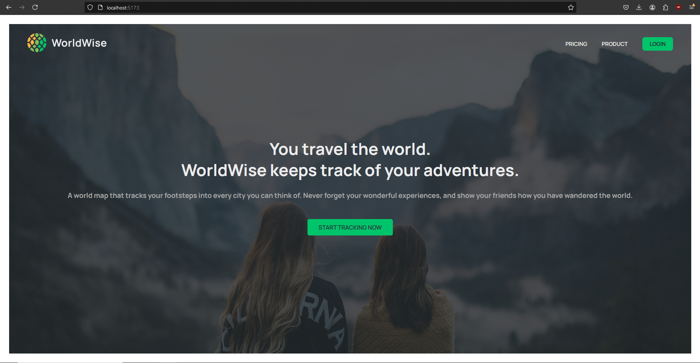
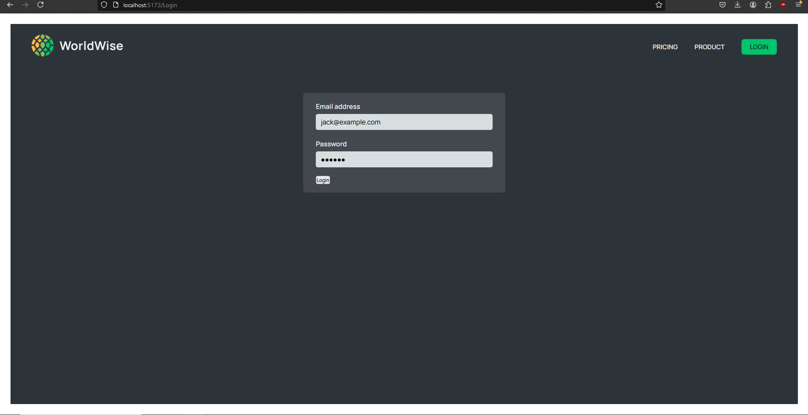
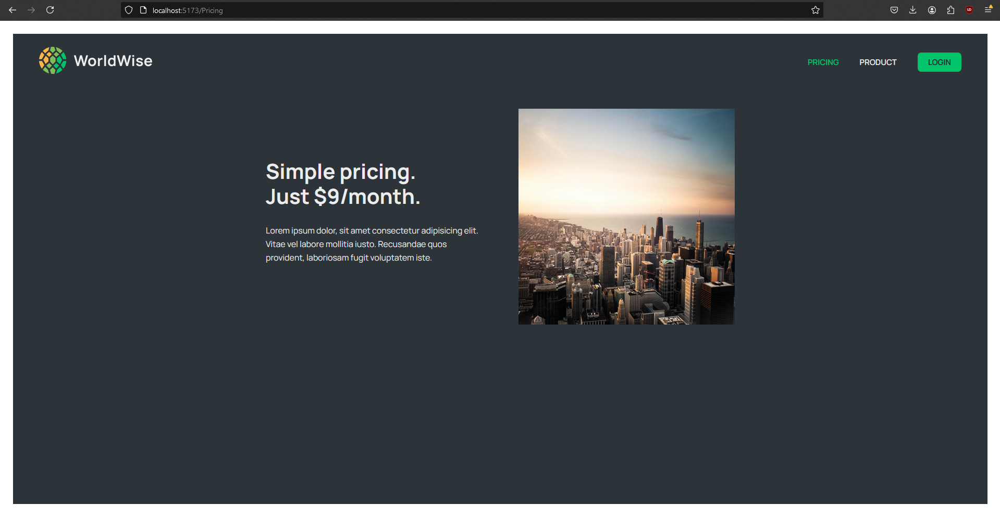
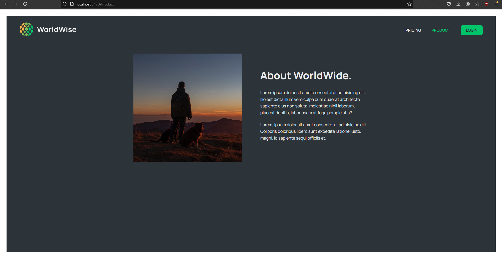
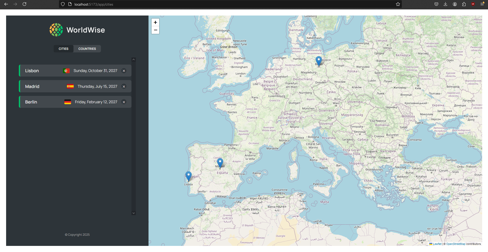
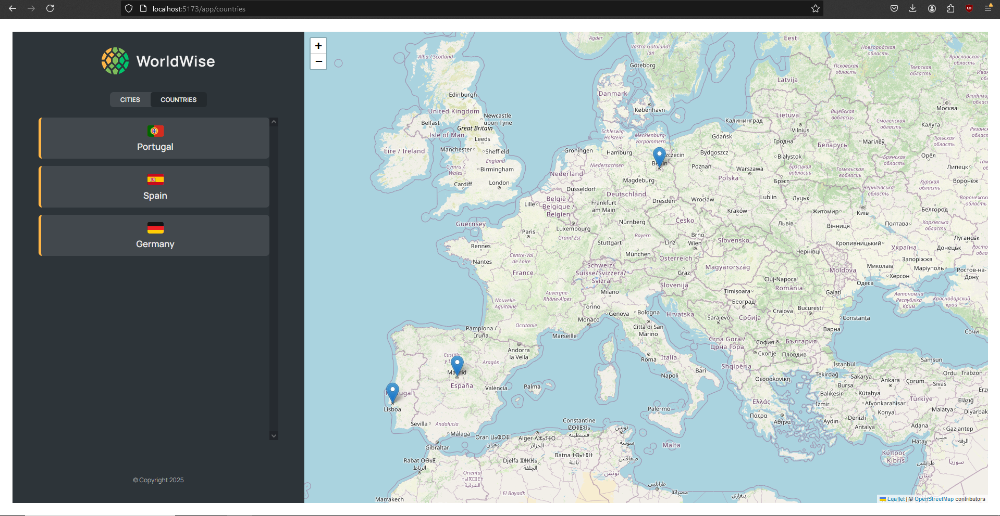

# Worldwise

## Overview
Worldwise is an interactive web application designed to let users record and visualize their travel experiences on a dynamic map. Utilizing the power of React.js and Vite, the application offers a responsive and intuitive interface that enhances user engagement and makes travel logging an enjoyable experience.

## Features
- **Interactive Map**: Users can click on a map to add locations they have visited, complete with descriptions and photos.
- **Travel Log**: Users can manage their travel records, update details, and delete entries.
- **User Authentication**: Secure signup and login functionality to manage personal accounts.
- **Mobile Responsive**: Fully responsive design that works on both desktops and mobile devices.

## Screenshots
Below are some screenshots that illustrate the functionality and user interface of the Worldwise application:
# Worldwise

## Screenshots

### Home Page

*The Home Page: Overview of the Worldwise application showing the main interface.*

### Login Page

*Login Page: Where users can enter their credentials to access their accounts.*

### Pricing

*Pricing: Detailed list of different subscription plans available.*

### Product

*Product Overview: Showcasing the main features and benefits of the product.*

### Map Interaction - View 1

*Map Interaction - View 1: Users can interact with the map to explore various trips.*

### Map Interaction - View 2

*Map Interaction - View 2: Another view where users can plan and visualize their trips.*

## Technologies Used
- **React.js**: For building the user interface in a modular, stateful way.
- **Vite**: Used as a build tool for faster and more efficient development experience.
- **Leaflet**: An open-source JavaScript library for mobile-friendly interactive maps.
- **React-Leaflet**: Provides an abstraction of 🍃 Leaflet as React components.

## Getting Started

### Prerequisites
Before you begin, ensure you have the following installed:
- Node.js (Preferably the latest LTS version)
- npm (Comes with Node.js)

### Installation
To set 
